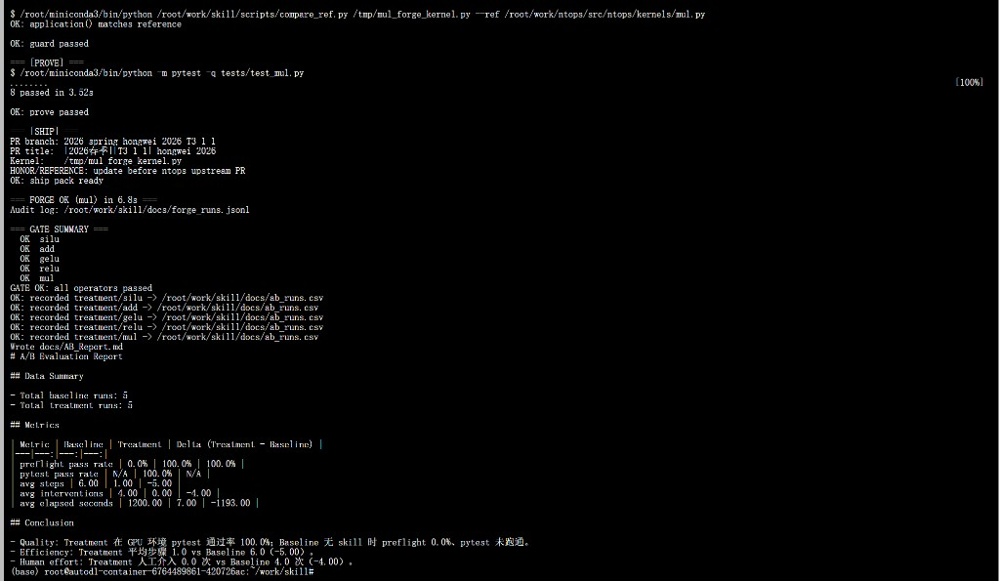
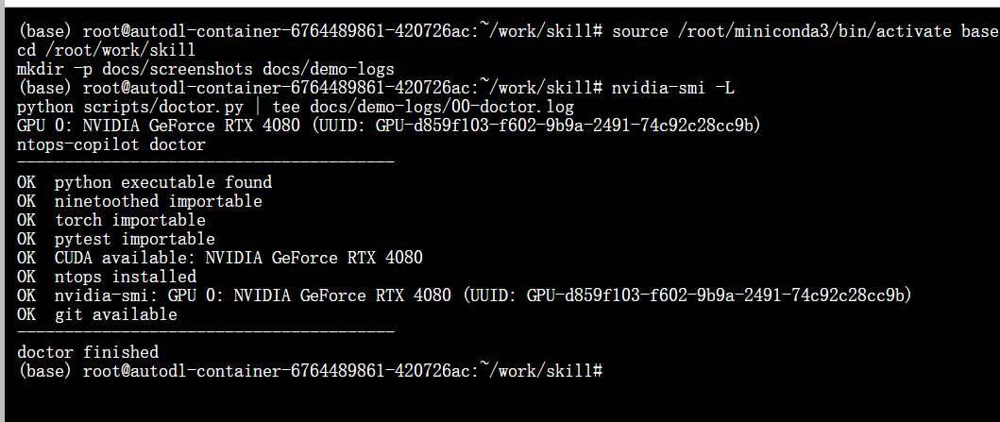
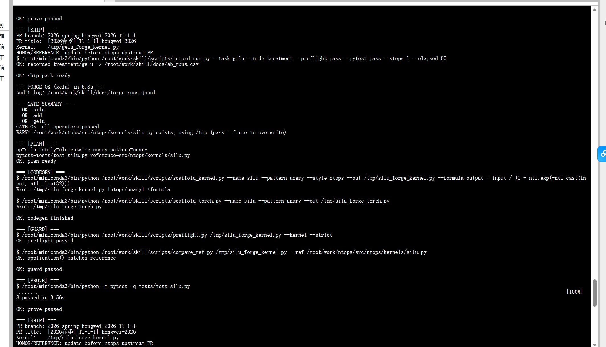
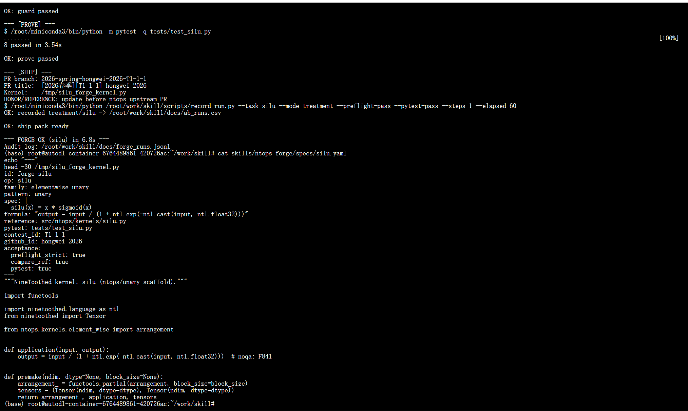
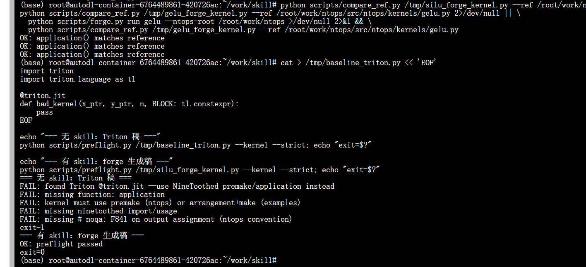
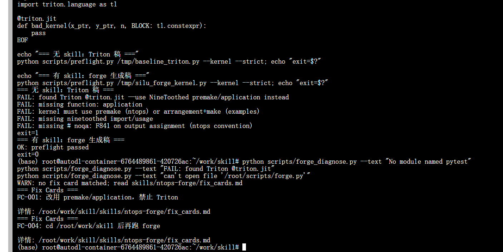
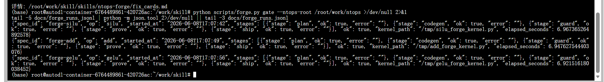
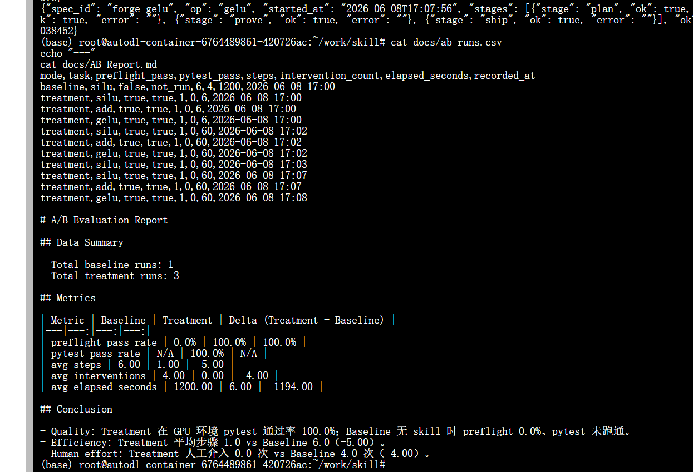

# 启元大赛 · 九齿 .skill 创新挑战 — ntops 算子工厂

> **选手**：于鸿伟 · **GitHub**：[hongwei-2026](https://github.com/hongwei-2026)  
> **仓库**：https://github.com/hongwei-2026/qiyuanbisai  
> **赛道**：九齿 .skill 创新挑战 · **阶段**：初赛提交

让 AI 智能体按 **可执行五段流水线** 完成 [InfiniTensor/ntops](https://github.com/InfiniTensor/ntops) 九齿算子开发，并在 GPU 上实测通过。

---

## 一句话

**`forge gate` 一键验收 5 算子**（silu / add / gelu / relu / mul）：公式注入 → 双护栏 → pytest 8/8 → jsonl 审计，RTX 4080 上约 35 秒跑完全部。

---

## GPU 实测（RTX 4080 · AutoDL）

```bash
source /root/miniconda3/bin/activate base
cd /root/work/skill
python scripts/forge.py gate --ntops-root /root/work/ntops
```

| 算子 | GUARD | pytest | 耗时 |
|------|-------|--------|------|
| silu | `matches reference` | 8 passed | ~7s |
| add | `matches reference` | 8 passed | ~7s |
| gelu | `matches reference` | 8 passed | ~7s |
| relu | `matches reference` | 8 passed | ~7s |
| mul | `matches reference` | 8 passed | ~7s |

```
GATE OK: all operators passed
```

### A/B 一键套件（推荐）

```bash
# 已 git pull 最新代码
python scripts/run_ab_suite.py --ntops-root /root/work/ntops

# 云机尚未同步时（无 run_ab_suite.py）
bash scripts/run_ab_manual.sh /root/work/ntops
```

预期：`5 baseline vs 5 treatment` + `GATE OK`。云机完整说明：[docs/CloudRun.md](docs/CloudRun.md)

优化说明：[docs/OptimizationSummary.md](docs/OptimizationSummary.md) · 竞品对比：[docs/CompetitiveAnalysis.md](docs/CompetitiveAnalysis.md)



完整截图说明：[docs/DemoShowcase.md](docs/DemoShowcase.md)

---

## 双 Skill 套件

| Skill | 版本 | 定位 | 一条命令 |
|-------|------|------|----------|
| **ntops-forge** | v1.0 | **主作品**：五段工厂流水线 | `python scripts/forge.py gate` |
| ntops-copilot | v0.5 | 轻量备选：单命令流程 | `python scripts/run_task.py --task silu --finish` |


```
PLAN → CODEGEN → GUARD → PROVE → SHIP
```

---

## 功能演示（截图）

### 环境自检 — 秒级确认可跑



### 五段流水线 — 单算子端到端



### 创新：规格驱动公式注入



### 优势：拦截 Triton 错误范式



### 创新：失败自动诊断



### 创新：jsonl 全链路审计



### A/B 量化 — 有 skill vs 无 skill

| 指标 | Baseline | Treatment |
|------|----------|-----------|
| preflight | 0% | **100%** |
| pytest | 未跑通 | **100%** |
| 步骤 | 6 | **1** |
| 人工介入 | 4 次 | **0 次** |



详情：[docs/AB_Report.md](docs/AB_Report.md)

---

## 快速开始

### 安装 Skill（Cursor / Agent）

```text
.cursor/skills/ntops-forge/      # 主 skill（推荐）
.cursor/skills/ntops-copilot/    # 轻量备选
```

### ntops-forge（推荐演示）

```bash
python scripts/doctor.py
python scripts/forge.py list
python scripts/forge.py run silu --ntops-root /path/to/ntops
python scripts/forge.py gate --ntops-root /path/to/ntops
python scripts/forge_diagnose.py --text "No module named pytest"
```

### ntops-copilot（快速路径）

```bash
python scripts/run_task.py --task silu --ntops-root /path/to/ntops --finish
```

### 环境要求

- GPU 机 + `source /root/miniconda3/bin/activate base`
- `pip install pytest` + `pip install -e /path/to/ntops`
- 工作目录：`/root/work/skill`（不要在 `$HOME` 跑脚本）

---

## 创新点摘要

1. **可执行 Skill**：规范落到 `preflight` / `scaffold` / `forge`，非空泛文档  
2. **工厂流水线**：PLAN→SHIP 五段闭环 + jsonl 审计  
3. **任务卡 / spec 驱动**：`formula` 自动注入 `application()`  
4. **语义对照**：`compare_ref` 对齐官方内核（含 gelu `default_application`）  
5. **精准 pytest**：只跑 `tests/test_<op>.py`，避免 conv2d 误失败  
6. **失败诊断**：fix_cards 自动匹配修复建议  
7. **NL→spec**：`forge_spec.py` 自然语言生成算子规格  

---

## 初赛提交材料

| 组委会要求 | 本仓库文件 |
|------------|------------|
| Proposal | [docs/Proposal.md](docs/Proposal.md) |
| .skill 初版 | [skills/ntops-forge/](skills/ntops-forge/) + [skills/ntops-copilot/](skills/ntops-copilot/) |
| 自测计划 | [docs/SelfTestPlan.md](docs/SelfTestPlan.md) |
| 中期报告 PDF | `docs/于鸿伟_九齿skill创新挑战_中期报告.pdf`（含 16 张实测附图） |
| 功能演示 | [docs/DemoShowcase.md](docs/DemoShowcase.md) |
| PR 描述模板 | [docs/PR_TEMPLATE.md](docs/PR_TEMPLATE.md)（对照组委会八项要求） |

### 官网表单

| 字段 | 内容 |
|------|------|
| Github 仓库 | https://github.com/hongwei-2026/qiyuanbisai |
| 附件 zip | `python scripts/pack_submission.py --stage initial` |

> 初赛**不需要 PR**。完整说明：[docs/SubmissionGuide.md](docs/SubmissionGuide.md)

---

## 目录结构

```text
skills/
  ntops-forge/          # 工厂流水线（主作品）
    SKILL.md, specs/, taxonomy.md, fix_cards.md
  ntops-copilot/        # 轻量副驾驶
    SKILL.md, tasks/, formulas.md
scripts/
  forge.py              # 主流水线 + gate
  run_ab_suite.py       # A/B 一键（Python）
  run_ab_manual.sh      # A/B 一键（bash 回退）
  run_task.py           # copilot 一键流
  compare_ref.py        # 语义对照
  preflight.py          # 结构护栏
  doctor.py             # 环境自检
docs/
  DemoShowcase.md       # 截图说明（答辩用）
  Proposal.md           # 提案
  MidTermReport.md      # 中期报告
  screenshots/          # GPU 实测截图（15+ 张）
```

---

## 身份信息

| 用途 | 填写 |
|------|------|
| 启元 / InfiniTensor 报名姓名 | 于鸿伟 |
| GitHub ID | hongwei-2026 |
| PR 分支命名 | `2026-spring-hongwei-2026-<赛题号>` |

---

## 许可

Apache-2.0（与 NineToothed / ntops 生态一致）
