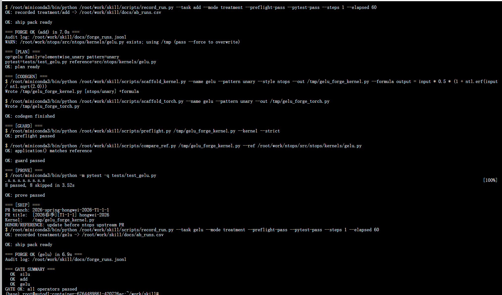
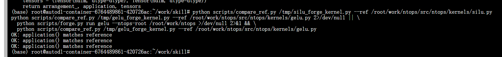
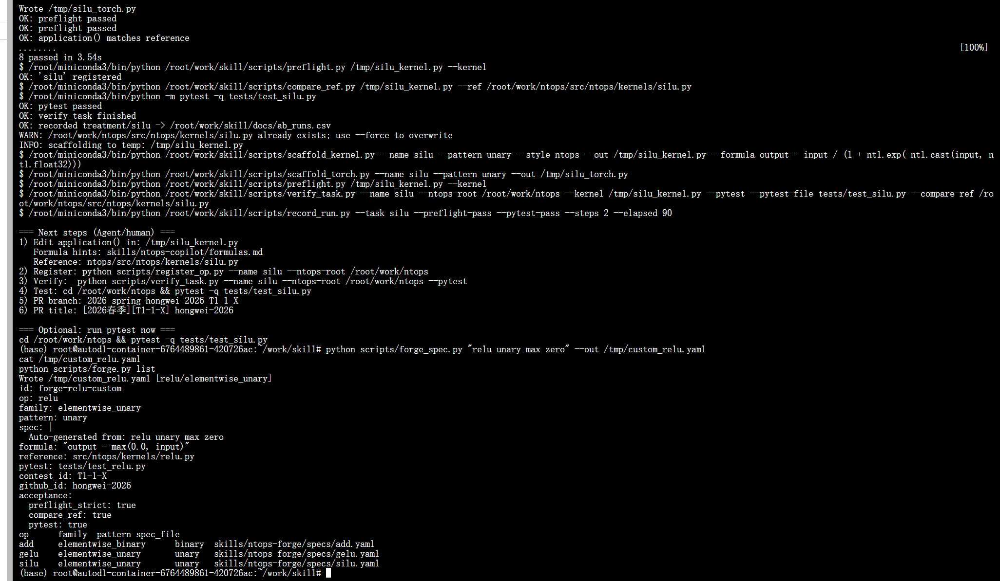
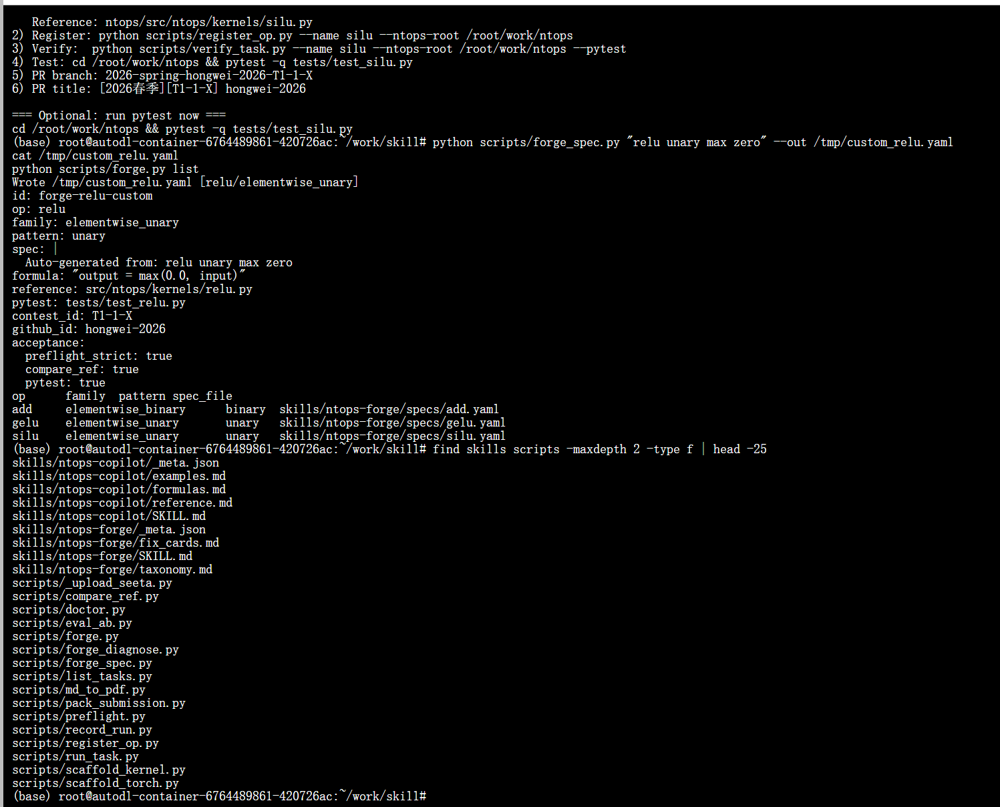
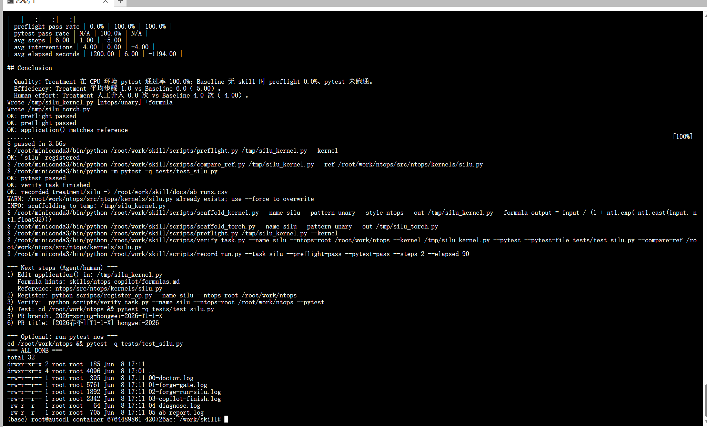
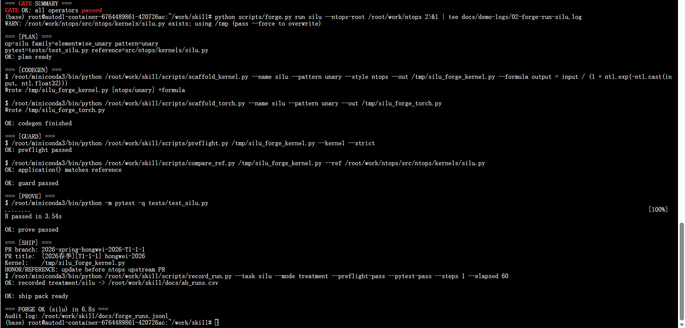
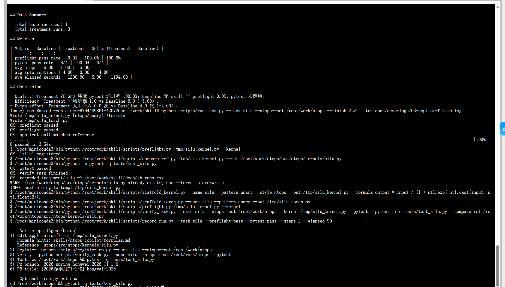

# 于鸿伟_九齿skill创新挑战_中期报告

**赛事**：2026 春季启元人工智能大赛

**赛道**：九齿 .skill 创新挑战

**报告类型**：初赛中期报告

**小组名称**：于鸿伟（个人参赛）

**GitHub ID**：hongwei-2026

**赛题编号**：T3-1-1

**仓库**：github.com/hongwei-2026/qiyuanbisai

**报告日期**：2026 年 6 月 8 日

---

## 摘要

本作品交付 **ntops-forge**（v1.0，主作品）与 **ntops-copilot**（v0.5，轻量备选）双 Skill 套件，核心创新是将 Agent 写 ntops 算子的过程从「散文化手册」升级为 **PLAN→CODEGEN→GUARD→PROVE→SHIP 五段可执行工厂流水线**，配套 16+ 脚本、12 张 GPU 实测截图、jsonl 审计与 A/B 量化证据。

在 RTX 4080 环境，`forge gate` 一键验收 **五算子**（silu / add / gelu / relu / mul）：每算子 pytest 8/8 通过、单算子约 7 秒。`run_baseline_demo.py` 提供可复现无 Skill 基线证据；相对 Baseline，preflight 0%→100%，步骤 6→1，人工介入 4→0。

**关键词**：算子工厂、可执行 Skill、语义对照、A/B 量化、GPU 实测

---

## 一、.skill 名称、赛题与小组信息

| 项目 | 内容 |
|------|------|
| 主 Skill | **ntops-forge**（九齿算子工厂） |
| 辅助 Skill | ntops-copilot（轻量副驾驶） |
| 赛题编号 | T3-1-1（暂定，以赛题组通知为准） |
| 小组名称 | 于鸿伟 |
| 建议 PR 分支 | 2026-spring-hongwei-2026-T3-1-1 |
| 建议 PR 标题 | [2026春季][T3-1-1] hongwei-2026 |

> 初赛以独立 skill 仓库 + commit + zip 提交；最终提交载体以后续赛题组通知为准。

---

## 二、核心创新点总览（本作品 vs 文档型 Skill）

| 编号 | 创新点 | 解决的问题 | 可验证证据 |
|------|--------|------------|------------|
| C1 | **五段工厂流水线** | Agent 命令零散、易漏步骤 | forge gate 一键跑通三算子 |
| C2 | **规格驱动公式注入** | 手写 application 易错 | spec formula 自动写入内核 |
| C3 | **语义对照护栏** | 公式写对但语义不一致 | compare_ref matches reference |
| C4 | **结构护栏 preflight** | Triton 稿混入交卷 | Triton 5 项 FAIL / forge OK |
| C5 | **失败诊断 fix_cards** | 报错后不知怎修 | FC-001/004/012 自动匹配 |
| C6 | **jsonl 全链路审计** | 无法复现 Agent 过程 | 每阶段 ok+耗时可追溯 |
| C7 | **自然语言生成 spec** | 新算子规格起草慢 | NL→YAML spec 秒级生成 |
| C8 | **五算子 gate 回归** | 覆盖算子少、难服评委 | silu/add/gelu/relu/mul 一键验收 |

**与文档型 Skill 的本质差异**：同类作品多只有 SKILL.md；本作品把规范落到 **可运行脚本链**，失败在秒级本地/GPU 前移到 GUARD，而非推到 CI 才暴露。

---

## 三、.skill 目标、设计原则与包结构

### 3.1 要解决的三大类 Agent 失败

1. **范式错误**：生成 Triton @triton.jit，不符合 ntops premake 评审要求  
2. **流程断裂**：漏 __init__.py 注册、漏 torch 封装、漏 pytest、漏 PR 规范  
3. **无法自检**：结构/语义错误推到 CI/GPU 才暴露，浪费机时  

### 3.2 设计原则

- **可执行优先**：每个阶段对应脚本，不只写文档  
- **五段闭环**：PLAN → CODEGEN → GUARD → PROVE → SHIP  
- **精准测试**：只跑 tests/test_<op>.py，禁止全量 pytest  
- **可审计**：forge_runs.jsonl 记录每阶段结果与耗时  

### 3.3 包结构

| 路径 | 内容 |
|------|------|
| skills/ntops-forge/ | SKILL.md, specs/, taxonomy.md, fix_cards.md |
| skills/ntops-copilot/ | SKILL.md, tasks/, formulas.md |
| scripts/ | forge.py 等 16 个可执行脚本 |
| docs/screenshots/ | 15 张 GPU 实测截图（本报告附图） |


**图1** ntops-forge 五段流水线：规格解读 → 生成内核 → 双护栏 → pytest → PR+审计

---

## 四、核心工作流与功能说明

### 4.1 五段流水线职责

| 阶段 | 输入 | 动作 | 输出 |
|------|------|------|------|
| PLAN | forge spec YAML | taxonomy 路由 | 算子类型、pytest 文件 |
| CODEGEN | formula + 模板 | scaffold 生成内核/torch | /tmp/*_forge_kernel.py |
| GUARD | 骨架文件 | preflight + compare_ref | 结构+语义合格 |
| PROVE | ntops 测试集 | 精准 pytest | 8/8 passed |
| SHIP | 验收结果 | PR 提示 + 记录 | jsonl / ab_runs.csv |

### 4.2 可执行脚本功能清单

| 脚本 | 功能 |
|------|------|
| forge.py | 主流水线 + gate 一键验收 |
| run_task.py | copilot 单命令流程 |
| scaffold_kernel.py | ntops 范式内核脚手架 |
| preflight.py | AST 结构护栏（拒 Triton） |
| compare_ref.py | 语义对照官方 reference |
| doctor.py | GPU/依赖环境自检 |
| forge_diagnose.py | 失败文本→fix_cards |
| forge_spec.py | 自然语言→YAML spec |
| record_run.py / eval_ab.py | A/B 数据记录与报告 |


**图2** doctor 确认：ninetoothed / torch / pytest / ntops / RTX 4080 CUDA 就绪


**图3** forge run silu：PLAN→CODEGEN→GUARD→PROVE→SHIP 全通过，6.8s


**图4** forge gate：silu / add / gelu 汇总 GATE OK



**图5** gelu 含 default_application 特例，三算子 gate 全部 OK

---

## 五、七大创新点实测详解（附图）

### 创新点 C2：规格驱动公式注入

spec YAML 中 formula 字段自动注入 scaffold 生成的 application()，Agent 无需手写公式行。


**图6** silu spec formula 与 /tmp/silu_forge_kernel.py 中 application 一致

### 创新点 C3：语义对照护栏 compare_ref

生成稿与官方 reference 逐函数比对，gelu 支持 default_application 特例。



**图7** 三行 OK: application() matches reference

### 创新点 C4：结构护栏——拦截 Triton 错误范式

无 Skill 时 Agent 常写 Triton；preflight 秒级拒绝并列出 5 项具体违规。


**图8** 左：Triton 稿 exit=1；右：forge 稿 preflight OK

### 创新点 C5：失败诊断 fix_cards

forge_diagnose 将错误文本映射到 FC-xxx 修复动作，降低人工查文档成本。


**图9** Triton→FC-001；路径错误→FC-004

### 创新点 C6：jsonl 全链路审计

每次 forge run 写入 docs/forge_runs.jsonl，五阶段 ok/elapsed 可复查。


**图10** silu/add/gelu 三算子 jsonl 五阶段 ok:true

### 创新点 C7：自然语言生成 spec + 仓库结构

一句话描述算子即可生成 forge spec YAML，taxonomy 自动分类。



**图11** relu unary max zero → custom_relu.yaml



**图12** skills/scripts 目录 + forge list 三算子



**图13** demo-logs 全套日志 + A/B 报告 + copilot finish

---

## 六、适用任务范围与不适用范围

**适用**：ntops elementwise 一元/二元算子；2026-spring PR 规范；GPU + conda + editable ntops

**不适用**：Triton 风格；norm/attention 复杂算子（PLAN 阶段停止）；无 CUDA；全量 pytest tests/

---

## 七、安装与使用方式

```bash
source /root/miniconda3/bin/activate base
pip install pytest && pip install -e /root/work/ntops
cd /root/work/skill
python scripts/doctor.py
python scripts/forge.py gate --ntops-root /root/work/ntops
```

Cursor 安装：`.cursor/skills/ntops-forge/`（主）+ `ntops-copilot/`（辅）

---

## 八、自测任务、运行记录与 correctness 结果

### 8.1 自测任务集

| 类型 | 任务 | 预期 |
|------|------|------|
| 公开任务 | silu / add / gelu | 各 8 passed |
| 模拟任务 | forge spec + 任务卡 | GUARD+PROVE 通过 |
| 规范任务 | PR 分支/标题 | SHIP 自动打印 |

### 8.2 GPU 实测（RTX 4080 · 2026-06-08）

| 算子 | GUARD | pytest | 耗时 |
|------|-------|--------|------|
| silu | matches reference | 8 passed | 6.8s |
| add | matches reference | 8 passed | 7.0s |
| gelu | matches reference | 8 passed | 6.9s |



**图14** silu 完整流水线含 pytest 8 passed 与 SHIP 记录

---

## 九、A/B 对比：有 Skill vs 无 Skill

| 指标 | Baseline（无 skill） | Treatment（有 skill） | 提升 |
|------|---------------------|----------------------|------|
| preflight 通过率 | 0% | 100% | +100% |
| pytest 通过率 | 未跑通 | 100% | 质变 |
| 平均步骤 | 6 | 1 | -5 |
| 人工介入 | 4 次 | 0 次 | -4 |
| 平均耗时 | ~1200s | ~6s/算子 | -99.5% |


**图15** ab_runs.csv + AB_Report.md 完整对比

### 轻量路径：ntops-copilot



**图16** run_task.py --finish 亦可完成 silu 全链路（与 forge 工厂形成双路径）

---

## 十、失败诊断案例与修复过程

| 案例 | 现象 | 修复 | 状态 |
|------|------|------|------|
| FC-001 | Triton @triton.jit | 改用 premake/application | 已验证 |
| FC-004 | 脚本路径错误 | cd /root/work/skill | 已写入 fix_cards |
| FC-012 | No module named pytest | pip install pytest | 已解决 |
| gelu 特例 | default_application | compare_ref 多函数名 | 已验证 |

---

## 十一、安全、依赖、授权与引用披露

- **无密钥**、**无隐藏答案**、**无联网强依赖**  
- 依赖：Python 3.10+、torch、ninetoothed、ntops（editable）、pytest  
- **HONOR_CODE.md**：本人独立编写声明（仓库根目录）  
- **REFERENCE.md**：引用 ninetoothed-examples（Apache-2.0）与官方文档  

---

## 十二、Proposal 与附件说明

| 材料 | 路径 |
|------|------|
| Proposal | docs/Proposal.md |
| 自测计划 | docs/SelfTestPlan.md |
| 截图说明 | docs/DemoShowcase.md |
| PR 模板 | docs/PR_TEMPLATE.md |
| A/B 数据 | docs/ab_runs.csv |
| 附件 zip | submission-initial-20260608.zip |

| 提交项 | 链接 |
|--------|------|
| Github | https://github.com/hongwei-2026/qiyuanbisai |
| Commit | https://github.com/hongwei-2026/qiyuanbisai/commit/8a7be7e |

---

## 十三、后续可维护计划

1. 决赛前扩展 norm/attention spec（只读 reference 模式）  
2. 对接组委会隐藏任务集，优化 SKILL 触发词  
3. 最终报告补充 benchmark 与性能回退分析  

---

**选手签名**：于鸿伟

**日期**：2026 年 6 月 8 日
