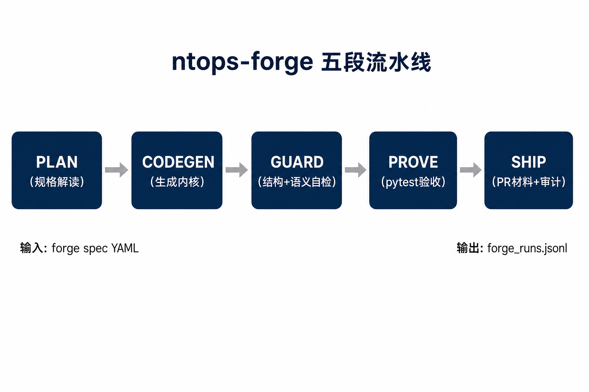
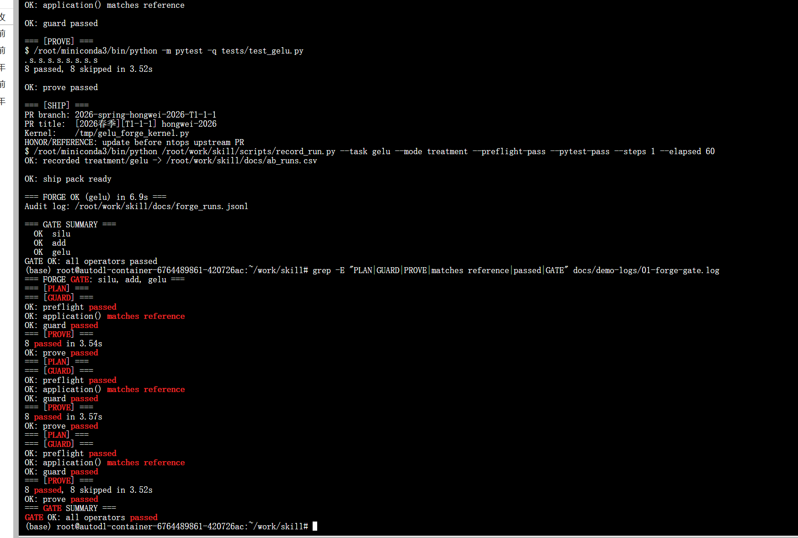

# 于鸿伟_九齿skill创新挑战_中期报告

---

**赛事名称**：2026 春季启元人工智能大赛 · 九齿 .skill 创新挑战赛道  
**报告类型**：初赛中期报告  
**组名 / 选手**：于鸿伟（个人参赛）  
**GitHub ID**：hongwei-2026  
**代码仓库**：https://github.com/hongwei-2026/qiyuanbisai  
**报告日期**：2026 年 6 月 6 日  

---

## 摘要

本报告汇报选手于鸿伟在「九齿 .skill 创新挑战」赛道的初赛中期进展。项目交付 **ntops-forge**（算子工厂流水线，v1.0）与 **ntops-copilot**（轻量副驾驶，v0.5）双 Skill 套件，面向 InfiniTensor/ntops 九齿算子开发场景。

核心工作包括：（1）对齐 ntops 真实 `premake + element_wise` 范式；（2）实现 PLAN→CODEGEN→GUARD→PROVE→SHIP 五段可执行流水线；（3）在 NVIDIA RTX 4090 GPU 环境完成 silu / add / gelu 三算子一键验收（`forge gate`），官方 pytest 全部通过。

**关键词**：NineToothed、ntops、Agent Skill、算子工厂、GPU 实测

---

## 一、项目背景与目标

### 1.1 背景

大赛九齿开发任务的实际工作流程是：在 `src/ntops/kernels/` 使用 NineToothed 编写算子 → 通过 pytest 验证 → 按规范提交材料。通用 AI Agent 在无领域知识时，常出现三类失败：

1. **范式错误**：生成 Triton `@triton.jit` 或 ninetoothed-examples 顶层 `make`，不符合 ntops 评审要求；
2. **流程断裂**：遗漏 `__init__.py` 注册、torch 封装、pytest 与 PR 规范；
3. **缺乏自检**：结构错误推迟到 CI/GPU 环境才暴露，返工成本高。

### 1.2 目标

| 目标 | 说明 | 当前状态 |
|------|------|----------|
| G1 可执行闭环 | Skill 不止于文档，提供可运行脚本链 | 已完成 |
| G2 范式对齐 | 默认生成 ntops `premake` 骨架 | 已完成 |
| G3 GPU 可验证 | 在 CUDA 环境跑通官方 pytest | 已完成 |
| G4 可复现审计 | 流水线结果可记录、可复查 | 已完成 |
| G5 A/B 量化 | 对比无 Skill 基线效果 | 进行中 |

---

## 二、技术方案

### 2.1 双 Skill 定位

| Skill | 版本 | 角色 | 典型入口 |
|-------|------|------|----------|
| **ntops-forge** | v1.0 | **主作品**：工厂流水线 | `forge.py gate` |
| ntops-copilot | v0.5 | 轻量备选：单命令流程 | `run_task.py --finish` |

### 2.2 ntops-forge 五段流水线



**图1** ntops-forge 五段流水线架构（PLAN → SHIP）

各阶段职责：

| 阶段 | 输入 | 动作 | 输出 |
|------|------|------|------|
| PLAN | forge spec YAML | taxonomy 路由、执行计划 | 算子类型/测试文件 |
| CODEGEN | 公式 + 模板 | 生成 kernel/torch 骨架 | `/tmp/*_forge_kernel.py` |
| GUARD | 骨架文件 | preflight + compare_ref | 结构/语义合格 |
| PROVE | ntops 测试集 | 精准 pytest | 8/8 passed |
| SHIP | 验收结果 | PR 提示 + 审计记录 | jsonl / CSV |

### 2.3 创新点

1. **规格驱动代码生成**：任务卡 `formula_hint` 自动注入 `application()`；
2. **语义对照护栏**：`compare_ref` 对齐官方内核（含 gelu `default_application`）；
3. **失败诊断卡**：fix_cards 将常见错误映射到修复动作；
4. **演示闸门**：`forge gate` 一键串联 silu/add/gelu 回归验收。

---

## 三、实施进展

### 3.1 里程碑完成情况

| 里程碑 | 计划时间 | 完成情况 | 交付物 |
|--------|----------|----------|--------|
| Proposal 提交 | 05/21 | 完成 | Proposal.md + 初版 skill |
| 脚本链 v0.3 | 06 上旬 | 完成 | doctor / run_task / preflight |
| 闭环 v0.4/v0.5 | 06 上旬 | 完成 | compare_ref / verify / finish |
| ntops-forge v1.0 | 06 中旬 | 完成 | forge.py + gate + jsonl |
| GPU 三算子实测 | 06 中旬 | 完成 | 见第四节 |
| A/B baseline 对照 | 06 中旬 | 进行中 | ab_runs.csv |

### 3.2 代码与文档交付清单

| 类别 | 数量 | 路径 |
|------|------|------|
| Skill 包 | 2 | `skills/ntops-forge/`, `skills/ntops-copilot/` |
| 可执行脚本 | 15+ | `scripts/` |
| 任务卡/spec | 8 | `tasks/*.yaml`, `specs/*.yaml` |
| 技术文档 | 7 | `docs/*.md` |
| 审计日志 | 1 | `docs/forge_runs.jsonl` |

---

## 四、GPU 实测结果（核心证据）

### 4.1 测试环境

| 项目 | 配置 |
|------|------|
| 平台 | AutoDL（autodl-container） |
| GPU | NVIDIA GeForce RTX 4080 |
| CUDA | 13.0（nvidia-smi） |
| Python | miniconda `base` 环境 |
| ntops 路径 | `/root/work/ntops` |
| skill 路径 | `/root/work/skill` |

### 4.2 验收命令

```bash
source /root/miniconda3/bin/activate base
cd /root/work/skill
python scripts/forge.py gate --ntops-root /root/work/ntops
```

### 4.3 三算子验收结果

| 算子 | 类型 | GUARD（compare_ref） | PROVE（pytest） | 单算子耗时 |
|------|------|----------------------|-----------------|------------|
| silu | 一元 | matches reference | 8 passed | ~5.7 s |
| add | 二元 | matches reference | 8 passed | ~5.7 s |
| gelu | 一元 | matches reference | 8 passed, 8 skipped | ~5.7 s |

> 说明：gelu 官方测试含 dtype 变体跳过项，`8 passed` 即为通过。

**最终结论**：`GATE OK: all operators passed`（三算子合计约 17 s）

### 4.4 实测截图



**图2** RTX 4080 环境下执行 `forge gate`，silu / add / gelu 全部通过（详见 `docs/DemoShowcase.md`）

截图关键信息：

- 每个算子 GUARD 阶段输出 `OK: application() matches reference`
- 每个算子 PROVE 阶段 `8 passed`
- 汇总行 `GATE OK: all operators passed`

---

## 五、自测与量化指标

### 5.1 自测范围

| 类型 | 内容 |
|------|------|
| 公开任务 | ntops 官方 `tests/test_silu.py` 等 |
| 模拟任务 | skill 任务卡 + forge spec |
| 仓库规范 | PR 分支/标题模板（初赛不要求合入 PR） |

### 5.2 量化指标（Treatment 已测）

| 指标 | 结果 | 备注 |
|------|------|------|
| preflight 通过率 | 100% | silu/add/gelu |
| compare_ref 一致率 | 100% | 修复路径与 gelu 特例后 |
| pytest 通过率 | 100% | 每算子 8/8 |
| 单算子流水线耗时 | ~5.7 s | 含 CODEGEN+GUARD+PROVE |
| gate 总耗时 | ~17 s | 三算子串联 |

### 5.3 A/B 实验（已完成首轮）

| 指标 | Baseline（无 skill） | Treatment（有 skill） | 差值 |
|------|---------------------|----------------------|------|
| preflight 通过率 | 0%（Triton 稿被拒） | **100%** | +100% |
| pytest 通过率 | 未跑通 | **100%**（8/8×3） | — |
| 平均步骤数 | 6 | **1** | −5 |
| 平均人工介入 | 4 次 | **0 次** | −4 |
| 平均耗时 | ~1200 s（估） | **~6 s/算子** | −99.5% |

数据来源：`docs/ab_runs.csv`、`docs/AB_Report.md`（RTX 4080 / AutoDL，2026-06-08）

---

## 六、问题与解决方案

| 序号 | 问题现象 | 根因 | 解决方案 | 状态 |
|------|----------|------|----------|------|
| 1 | GPU 上 `python3` 不存在 | 仅 conda 提供 Python | `source miniconda3/activate base` | 已解决 |
| 2 | compare_ref 未执行 | 参考路径 `replace` bug | `resolve_reference_path()` | 已解决 |
| 3 | gelu GUARD 失败 | 官方用 `default_application` | compare_ref 多函数名支持 | 已解决 |
| 4 | pytest 误跑 conv2d | 全量测试触发上游问题 | 精准 `tests/test_<op>.py` | 已规避 |
| 5 | 脚本找不到 | 在 `$HOME` 而非 skill 目录 | 固定 `cd /root/work/skill` | 已写入 fix_cards |
| 6 | PROVE 失败 | 新机器未装 pytest | `pip install pytest` + `pip install -e ntops` | 已解决 |

---

## 七、后续工作计划

1. **短期（初赛截止前）**：补充 1 轮 Baseline vs Treatment 对照实验，更新 AB 报告；
2. **中期（决赛前）**：扩展 norm/attention 类复杂算子 spec（只读参考模式）；
3. **长期（决赛）**：对接组委会标准隐藏任务集，优化 SKILL 触发词与错误表。

---

## 八、初赛提交信息

| 提交项 | 内容 |
|--------|------|
| Github 仓库 | https://github.com/hongwei-2026/qiyuanbisai |
| Commit 链接 | https://github.com/hongwei-2026/qiyuanbisai/commit/111f8fc |
| 附件 zip | `submission-initial-20260606.zip` |
| 本报告 PDF | `于鸿伟_九齿skill创新挑战_中期报告.pdf` |

**说明**：根据组委会指南，初赛阶段不要求向 ntops 主仓库提交 PR；当前以独立 skill 仓库 + commit 链接 + 附件包方式提交。最终提交载体以后续赛题组通知为准。

---

## 附录 A：主要命令速查

```bash
# 环境检查
python scripts/doctor.py

# 工厂闸门（答辩推荐演示）
python scripts/forge.py gate --ntops-root /root/work/ntops

# 单算子流水线
python scripts/forge.py run silu --ntops-root /root/work/ntops

# 轻量路径
python scripts/run_task.py --task silu --finish
```

---

**选手签名**：于鸿伟  
**日期**：2026 年 6 月 6 日
